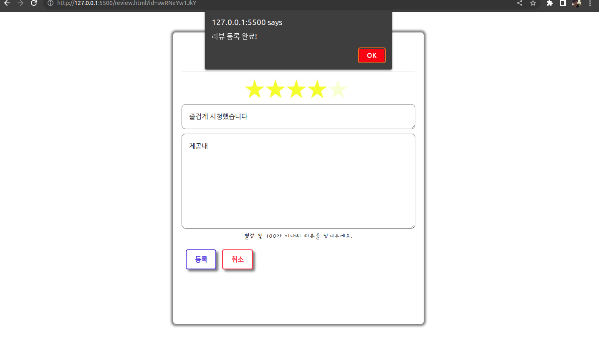
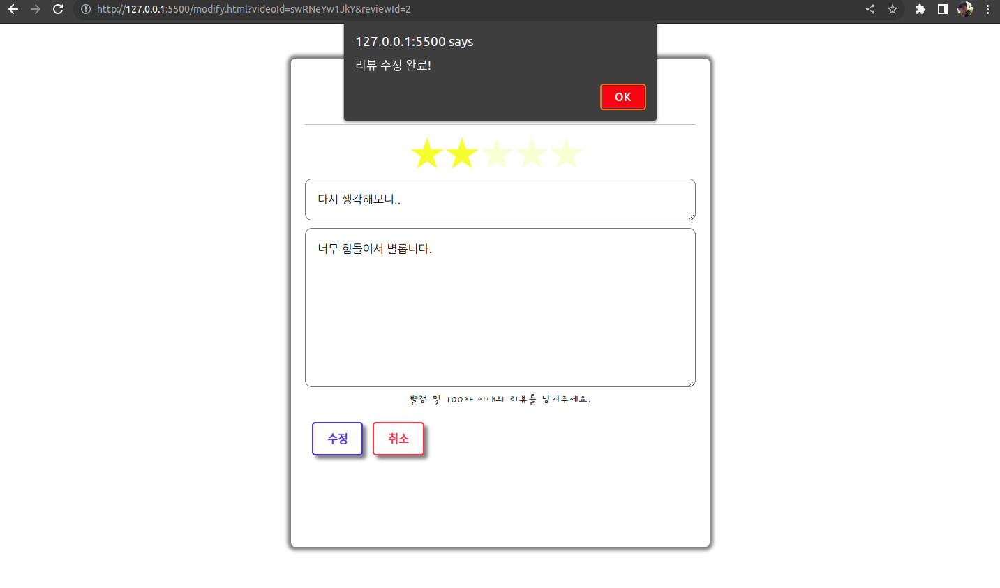

# SSAFIT Project(Read.me)

| 프로젝트명 | SSAFIT Project |
| --- | --- |
| 단계 | Web Front PJT |
| 진행일자 | 2022.09.02 ~ 09.03 |
| 인원 | 양영건, 우상빈 |

# 1. 프로젝트 목표 👀

- 수업 과정에서 배운 Web Front 기술인 HTML / CSS / Javascript를 이해하고 활용할 수 있다.
- CSS, Bootstrap을 활용해서 향상된 디자인을 구현할 수 있다.
- Ajax를 활용해서 사이트를 구축할 수 있다.
- UX(사용자 경험), UI(사용자 인터페이스)를 고려한 사이트를 구현하여 사용자 입장에서 편리하고 멋진 디자인을 설계해 본다.

# 2. 요구사항 👀

1) Wireframe Tool을 이용하여 구현할 웹 페이지 프로토타입을 설계해 본다.

2) 웹페이지 구현시 VSCode를 이용하여 구현한다.

3) 기본 기능

- 다양한 운동영상 정보와 영상의 리뷰와 관련된 페이지를 제공한다.
    - 메인 페이지 구성

        운동영상 정보의 다양한 화면 구성(최근 인기 영상, 운동 부위별 영상 등)

        메인페이지의 영상화면은 제공된 Ajax를 이용(json 데이터 파일 로딩)

    - 메뉴 구성 : 사이트의 주요 메뉴를 구성
    - 운동 영상에 대한 리뷰 관리 페이지 구성

        목록, 등록, 수정, 상세, 삭제 등

# 3. 기능 구현 화면 👀

## ✔ 메인 화면(index.html)

- 메인페이지에는 배너와 검색창, video.json으로부터 불러온 운동 영상들이 보여집니다.
- 운동 영상 목록에서 화살표를 누르면 다음 영상들을 볼 수 있습니다.
- 페이지의 아래에는 운동 부위 별로 선택하여 영상들을 볼 수 있는 목록이 있습니다.
- 영상을 클릭하여 영상을 실행할 수 있습니다.
- 영상 아래의 제목을 클릭하여 해당 영상에 작성된 리뷰 목록으로 이동할 수 있습니다.

## ✔ 리뷰 목록 화면(list.html)

- 이 화면에서는 영상 및 해당 영상에 작성된 리뷰의 목록을 볼 수 있습니다.(각 영상 별로 구현)

    

- 모든 리뷰 목록은 브라우저의 로컬 스토리지에 저장된 리뷰 데이터로부터 읽어옵니다.
- 해당 영상에 대한 리뷰는 url로 전달된 동영상 id를 이용하여 찾아 읽어옵니다.
- “글 작성” 버튼을 클릭하여 리뷰 등록 화면으로 이동할 수 있습니다.
- 리뷰의 제목을 클릭하여 리뷰 상세 화면으로 이동할 수 있습니다.

## ✔ 리뷰 등록 화면(review.html)

- 리뷰 목록 화면에서 “글 작성” 버튼을 클릭하여 이동한 리뷰 등록 화면입니다.
- 별점을 선택하지 않고 “등록” 버튼을 누르면 “별점을 선택해 주세요.”라는 안내 문구가 등장합니다.
- 제목이나 내용을 작성하지 않고 “등록” 버튼을 누르면 “제목과 내용을 작성해 주세요.”라는 안내 문구가 등장합니다.
- 리뷰가 작성되면 아래처럼 리뷰 목록 화면으로 돌아오며, 새로운 리뷰가 잘 등록된 것을 확인할 수 있습니다.

    

## ✔ 리뷰 상세 화면(detail.html)

- 리뷰 목록 화면에서 리뷰의 제목을 클릭하여 이동한 리뷰 상세 화면입니다.
- 선택한 리뷰의 제목, 내용, 별점, 작성 시간을 확인할 수 있습니다.
- “목록” 버튼을 클릭하여 리뷰 목록 화면으로 돌아갈 수 있습니다.
- “글 수정” 버튼을 클릭하여 리뷰 수정 화면으로 이동할 수 있습니다.
- “글 삭제” 버튼을 클릭하여 해당 리뷰를 삭제할 수 있습니다.

## ✔ 리뷰 수정 화면(modify.html)

- “글 수정” 버튼을 클릭하여 이동한 리뷰 수정 화면입니다.
- 기존에 선택했던 별점과 작성했던 제목 및 내용이 그대로 나타납니다.
- 리뷰의 별점과 제목 및 내용을 수정하고 “수정” 버튼을 클릭하여 리뷰를 수정할 수 있습니다.

## ✔ 리뷰 삭제

- 방금 수정한 리뷰를 “글 삭제” 버튼을 클릭하여 삭제해보았습니다.

    

- 리뷰를 삭제하면 아래처럼 리뷰 목록 화면으로 돌아오며, 해당 리뷰가 잘 삭제된 것을 볼 수 있습니다.

    

# 4. 관통 프로젝트 소감 👀

- 양영건 🤔

오랜만에 다시 보는 javascript여서 익숙해지는데 시간이 필요했습니다. 기억을 더듬어가며 수업 때 교수님이 해주셨던 강의와 인터넷 검색으로 하나씩 화면과 기능을 완성해나가는 작업이 즐거웠습니다. 페이지를 만들 때 레이아웃을 HTML과 CSS로 만드는 작업이 생각보다 많은 시간이 소요되고 어려운 작업이었는데 Bootstrap의 태그 기능이 꽤 도움이 되었던 것 같습니다. 다른 팀들은 아예 템플릿 자체를 Bootstrap에서 가져와 사용하는 방식도 적용하는 것 같았는데 화면을 빠르고 멋지게 만드는 점이 놀라운 점이었습니다. 기능을 구현하는데 있어서는 페이지간 연결을 하는 작업, 특히 parameter를 전달해주는 작업을 생각하는게 어려웠는데 URL을 이용하여 기능을 완성하니 뿌듯했습니다. 앞으로 백엔드 기술도 배워서 더 완성도있는 어플리케이션을 만들어보고 싶습니다.

- 우상빈🤦‍♂️

Front 관통 프로젝트이다 보니, 각각의 화면 페이지만 구성해도 충분하다는 마음가짐을 가지고 시작을 했었지만, 각자 맡은 페이지를 완성하고 나니 페이지의 상호 연결도 진행하게 되었다. 내가 만든 페이지는 누가 봐도 센스가 부족한 사람이 만들어낸 디자인을 가지고 있어서, 나름 산뜻한 느낌을 주기 위해 여러 변화를 주었지만 투박함을 다 감출 수 없는 모습이다. 이러한 다채로운 센스가 부족함을 인정하고 부트 스트랩 등의 테마를 애용하도록 해야겠다.

아무튼 이번 프로젝트를 통해 8월에 배웠던 JS와 CSS를 복습할 수 있는 좋은 계기가 되었다. 추가 기능인 회원가입 및 로그인과 심화 기능인 찜 목록 및 친구 목록 기능까지는 구현하지 못해 아쉬움이 남지만 지금 완성한 부분들도 너무 어렵게 느껴졌다.
